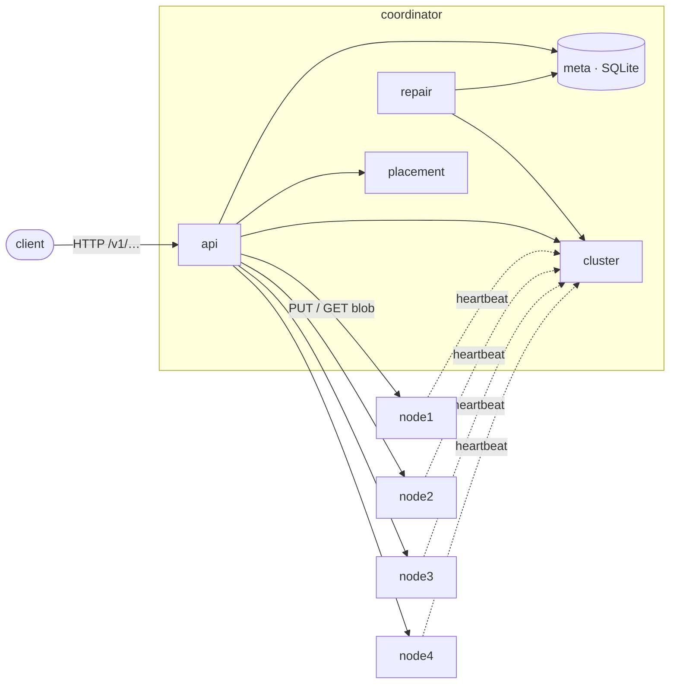

# Shardwell

Distributed object storage in Go: one coordinator, N storage nodes, replicated checksummed blobs.

[](https://github.com/manavmann/distributed-object-storage/actions/workflows/ci.yml)

**Status:** four-node cluster in Docker with replication factor 3 and write quorum 2;
reads fail over when a holder is down; repair, GC, and Prometheus metrics complete. Run `make demo` for the full walkthrough.

## Architecture



## How it works

- **PUT** spools the body to the coordinator's disk while hashing it, ranks the healthy
  nodes for the key (rendezvous hashing), writes the blob to `CAIRN_REPLICATION_FACTOR`
  nodes in parallel and commits once `CAIRN_WRITE_QUORUM` of them acknowledge a
  checksummed write. The response `ETag` is the sha256.
- **Metadata is the only truth.** SQLite holds buckets, objects and `replicas` rows, and
  a replica row exists only for a node that acknowledged the write. Readers never
  recompute placement; they ask metadata where the blob is.
- **GET** tries the UP holders in random order, then the DOWN ones, one attempt each.
  A node verifies the full payload hash before serving a byte; a corrupt copy is
  quarantined on the node and its replica row dropped, and the read moves on.
- **Nodes** write `tmp → fsync → rename → fsync dir`, so nothing under `blobs/` is ever
  partial. They register by heartbeating the coordinator, which marks them DOWN after
  `CAIRN_HEARTBEAT_TIMEOUT` of silence and UP again on the next heartbeat.
- **Overwrites and deletes** never touch blobs inline: every PUT gets a fresh
  `blob_id`, and old blobs are queued in `pending_deletes` for the repair/GC worker.

## Quickstart

Requires Docker with Compose v2, `make`, `bash`, `curl` and `sha256sum`.

```sh
make up      # build the image, start coordinator + node1..node4, wait until all are healthy
make smoke   # bucket, 8 MiB PUT, GET + sha256, locate → 3 replicas, stop a holder, GET
             # still matches, holder goes DOWN then UP, HEAD, list, DELETE, GET → 404; prints PASS
make logs    # follow all containers
make down    # stop and delete the named volumes
```

The coordinator's API is on http://localhost:8080:

```sh
curl -X PUT localhost:8080/v1/photos                       # create bucket   → 201
curl -X PUT localhost:8080/v1/photos/cat.jpg -T cat.jpg    # put object      → 200, ETag = sha256
curl      localhost:8080/v1/photos/cat.jpg -o out.jpg      # get object      → 200 (verified payload)
curl -I   localhost:8080/v1/photos/cat.jpg                 # head object     → 200
curl      "localhost:8080/v1/photos/?prefix=c&limit=10"    # list objects    → 200
curl -X DELETE localhost:8080/v1/photos/cat.jpg            # delete object   → 204
curl      localhost:8080/cluster/status                    # node health     → 200 (UP/DOWN per node)
curl      "localhost:8080/cluster/locate?bucket=photos&key=cat.jpg"  # replicas + placement → 200
```

## What works

- Buckets: create, info (`GET /v1/{bucket}` with object count).
- Objects: PUT (spooled to disk, sha256-hashed, ≤ 64 MiB), GET, HEAD, DELETE,
  listing with `prefix`, `limit` (≤ 1000) and `start_after`.
- Replication: quorum writes (`CAIRN_REPLICATION_FACTOR` / `CAIRN_WRITE_QUORUM`,
  default 3/2) with fallback targets; failover reads across holders;
  `GET /cluster/locate` shows where an object lives.
- Storage node: atomic blob writes (tmp → fsync → rename), full-hash verification
  before serving a byte, corrupt blobs quarantined and never served.
- Metadata in SQLite is the only source of truth; replica rows exist only for
  acknowledged, checksummed writes.
- Cluster membership from heartbeats: nodes register by posting to
  `/internal/heartbeat`; the monitor marks a node DOWN after
  `CAIRN_HEARTBEAT_TIMEOUT` (default 15s) of silence and UP again on the next
  heartbeat. `GET /cluster/status` shows every node.
- Packaging: one distroless image with both binaries (`deploy/Dockerfile`), no
  shell; `-healthcheck` flag on each binary backs the compose healthchecks.

Repair, GC, and Prometheus metrics are all implemented. See `docs/architecture.md` for the full design.

## Development

```sh
make build   # binaries into bin/
make test    # go test -race ./...
make lint    # gofmt + go vet
```

Configuration is by `CAIRN_*` environment variables; see `internal/config`.
